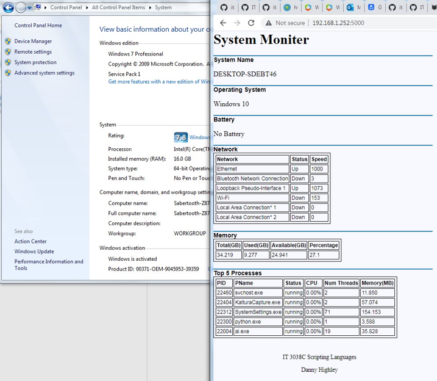

## Finale Project

==========

For the Final project, I decided to continue exploring python and flask and create a script that would monitor some system stats and processes that not only print to console but would also be accessible via html over the internet. So if you had a system doing something you wanted to keep an eye on remotely, you could enter its IP address remotely and view the system specs if the script was running.

==========

It has been a learning experience getting flask to convert the system information to html and for variables to be dynamically updated at a set interval in the html. So one can simply hit the refresh button in the html and see the processes or memory usage update. I'll touch on some of the learning moments in this read me.

==========

The python scripts are web.py and sysmonitor.py and the supporting html files will be layout.html, main.html and styles.css all located in the Final folder in the Github repository. The file structure of its supporting files is important, and I'll cover that in a following section. I recommend running the script from the python virtual environment venv folder as there are a few modules that will need to be installed. I wrote the script on a Windows 11 system using Windows PowerShell and Windows PowerShell ISE.

==========

**Python Virtual Environment**

If your already familiar with Python's venv method of isolating your project then you can skip this and do what you know how to do.
If not, do the following to set up your venv virtual environment:
- create a folder on the C: drive called venv.    
- in PowerShell move to that folder ```C:\venv```    
- run the following command: ```python -m venv Flask```    
- move to the newly created Flask folder: ```cd Flask```    
- run the following command: ```Scripts\activate.ps1```   

You should see (Flask) in front of your command line like this:


This is where you will install the needed modules.     
This is where you will run the web server (web.py).    
The actual file can be stored somewhere else on your system.

==========

**Python Modules you will need to run this Script**

While your here:


Install the following modules inside the active Flask environment:   

flask   
psutil   
prettytable   
apscheduler   

with the following commands:   
```pip install flask```   
```pip install psutil```   
```pip install prettytable```   
```pip install apscheduler```   

The rest of the modules used should already be loaded, if not, use the pip install method to load them.

==========

**Copy the files from GitHub**

Copy the files from GitHub to your system including the folder setup.   
These can be in a location of your choosing, but set up just like in Github.    
Parent folder can be name of your choosing.     
Flask needs the static and template folders named as such to work properly.    
Files needed for this script:
- web.py
- sysmonitor.py
- layout.html
- main.html
- styles.css

File structure should look like this:


==========

**To Run the Script**

Run the script while in the python venv virtual environment.


By entering ```python "path to the web.py file"```

For example:


The script refreshes every 10 seconds.     
When you see the console output the system data you should be able to access the web page.

To access the web page, open a browser (I'm using edge) and enter the url: localhost:5000

Html output:


You should be able to refresh the web page every 10 seconds to see updated memory and process data.

==========

**Elements used in the script**

We start the script by opening a web server by running web.py:


This points to and runs sysmonitor.py and starts listening on two ip addresses:   
- 127.0.0.1:5000 (localhost)   
- and the IP address of the host system, in my case 192.168.1.252:5000   

sysmonitor.py auto runs loading the necessary modules.  
Notable ones are:   
- flask - is a web application framework for python, allowing python to create web content.   
- psutil - allows us to pull certain system information like memory, battery, processes.
- platform - allows us to pull hostname and operating system information.
- prettytable - allows us to create formatted tables quickly from arrays and lists.
- apscheduler - allows us to refresh retrieved data at set intervals.

I then created a function to pull the system information called sensor(). Through a little trial and error I determined a function to pull the data was the best route, as I quickly found out that flask does not like while True loops as it tracks variables passed 
to the HTML by threads and will not allow the same variable to be passed twice over the same thread. 

While you could certainly include other system parameters, I chose a few to illustrate the concept.
- system name
- operating system and release
- battery information
- network information
- memory information
- top 5 processes by cpu percentage

As stated early, I wrote and tested this on a Windows 11 system. However, when I pull the OS release data, it states I'm using Windows 10. Turns out Windows developers still have kernel32.dll pointing to Windows 10 for compatibility issues.

Using psutil to iterate through specific system data in conjunction with prettytable made pulling that data into a presentable table pretty straight forward with the .add_row() built in function. For example:

``` print("--- Network Info ---")     
    global table     
    table = PrettyTable(['Network', 'Status', 'Speed'])     
    for key in psutil.net_if_stats().keys():     
        name = key   
        if psutil.net_if_stats()[key].isup:    
            up = "Up"    
        else:   
            up = "Down"    
        speed = psutil.net_if_stats()[key].speed    
        table.add_row([name, up, speed])    
    print(table) # to console   
```
The prettytable format is designed for consoles. In order to pass it to the HTML later it needed to be converted to HTML format.

```
   #convert memTable to html 
   memTable = memTable.get_html_string()
```
Notice the use of global variables inside the function - this allows variables used in the function to be passed from Flask to HTML outside of the function.

At this point I initialized app to Flask

```
app = Flask(__name__, static_folder='static')
app.config.from_object(__name__)
```
This is also where you have to declare the static folder for where Flask can find the css style data.

Before sending the variables to the HTML document we need to schedule a task with the apscheduler. 

``` 
sched = BackgroundScheduler(daemon=True)    
sched.add_job(sensor,'interval',seconds=10)    
sched.start()     
```
As mentioned earlier, Flask does not like traditional loops and timers to refresh data, so I could not use a while True loop. Flask will not send the same variable twice over the same thread. To get around this, I used the apscheduler module to schedule a refresh function to pull system information every 10 seconds. The (daemon=True) tells the scheduler to use a new thread each time it pulls the system information with the sensor function. This lets Flask keep the HTML document updated every 10 seconds, or whatever interval you choose.

It was also discovered that the apscheduler does not play nice with the Flask's debug function, causing the schedule to trigger twice every iteration. You could see this on the console output and is a known problem with Flask and Apschedule. To solve this issue, I had to disable Flasks debugger by removing debug=True.

Now we can have Flask send the variables to the HTML
``` 
@app.route('/')
def monitor():
    return render_template("main.html",
        opSystem=opSystem,
        opRelease=opRelease, 
        hName=hName,
        battery=battery, 
        table=table, 
        memTable=memTable,
        procTable=procTable)
```

===========

## HTML documents

Starting with the layout.html

```
<!DOCTYPE html>   
    <html lang="en">    
    <head>    
        <title>IT 3038C Scripting Languages</title>   
        <meta charset="utf-8">   
        <link rel="stylesheet" href="{{ url_for('static', filename='stylesheets/styles.css') }}" />   
    </head>    
    <body>   
        <H1>System Moniter</H1>   
        <br />   
           
           
        <footer>    
        <p>IT 3038C Scripting Languages</p>   
        <p>Danny Highley</p>    
    </body>    
</html>    
```
While you can spend a lot of time developing these, there is a couple points to note:
```
<link rel="stylesheet" href="{{ url_for('static', filename='stylesheets/styles.css') }}" />
```
This is where you link the css styles that we declared earlier, allowing css styles to work on your HTML pages.

and

```
   

```
This defines where html data resides from subsequent HTML pages - in our case, we will see the link on our main.html

The main.html consists of our variable links and some h3 headers.

```
   

   

<h3>System Name</h3>   
<p>{{ hName }}</p>   
<p> </p>   

<h3>Operating System</h3>   
<p>{{ opSystem }} {{ opRelease }}</p>   
<p> </p>   

<h3>Battery</h3>   
<p>{{ battery }}</p>   
<p> </p>   

<h3>Network</h3>   
{{ table | safe }}   
<p> </p>

<h3>Memory</h3>   
{{ memTable | safe }}   
<p> </p>   

<h3>Top 5 Processes</h3>   
{{ procTable | safe }}   


```    
Notice all of the variables passed from Flask reside within the block content.
The use of the variables allows the web site to update its data every 10 seconds.

===========

The loopback 127.0.0.1 on port 5000 is fine when testing the script.    

With a little tweaking of the host firewall settings I was able to connect to the IP url (in my case: 192.168.1.252:5000) from other devices as intended, as show in the following pic using a Windows 7 system.



Press Control C in the console to stop the script.
