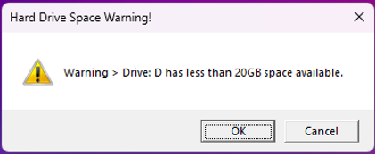

## Project 2

==========

For Project 1, I chose to do a PowerShell script for one of the listed suggestions:
"Write a script that tells you how much hard drive space you have left"
The script would accomodate multiple drives and display info on the console.

==========

When i think of scripts, I envision something running in the background perfoming a function the user isn't normally thinking about. For Project 2, I chose to expand upon the Project 1 script and create a script that will alert the user with a warning if any hard drive on their computer falls below a specified remaining storage limit.

==========

The script name is spacewarning.ps1 in the Project 2 Github repository, and once copied can be ran from the PowerShell command line with ./spacewarning.ps1. While runing it this manner should work fine, the end goal is to set the script up to run automatically at windows startup, and have a pop up window be presented to the user should a hard drive fall below the specified remaining storage limit. I wrote the script on a Windows 11 system using Windows PowerShell and Windows PowerShell ISE.

==========

**Elements used in the script**

The script is thoroughly commented but I'll touch on how the script flows.

The script first pulls some system information:   

```$env:COMPUTERNAME``` to pull the name of the computer   
```IP = ((ipconfig | findstr [0-9].\.)[0]).Split()[-1]``` to filter out just the ip address from ipconfig

Establishes the minimum disk size to raise a warning to 20GB

```$minSize = 20GB```   
```$minSize = [math]::Round($minSize/1GB,2)```

Find all the hard drives on the system by filtering through Get-WmiOject win32_volume data.
Then assign the found drive letters to an array.

``` $localVolumes = Get-WmiObject win32_volume
    $drives = @();
    foreach ($vol in $localVolumes) {
        if ($vol.DriveType -eq 3 -And $vol.DriveLetter -ne $null ) {
            $drives += $vol.DriveLetter[0];
        }
    }
```

Move through each element in the drive letter array and extract drive storage specs.

```foreach ($d in $drives) {
    $disk = Get-PSDrive $d;
    $diskFree = [math]::round($disk.Free/1GB,2)
    $diskUsed = [math]::round($disk.Used/1GB,2)
    $diskTotal = [math]::round($diskFree + $diskUsed)
    Write-Host "Drive:" $d "has a total of"$diskTotal "GB ("$diskUsed "Used /"$diskFree "Free )"
}
```

Set a flag to trigger warning to the user if available strorage space falls below threshold.

If warning needs to be sent, move through the drive letter array and store warning messages to new array. I didn't want multiple popups for each drive below the threshold, just one warning sent that would list all drives below threshold. The new array solves this.

``` foreach ($d in $drives) {
        $disk = Get-PSDrive $d;
        $diskFree = [math]::round($disk.Free/1GB,2)
        if ($diskFree -lt $minSize) {
            Write-Host "Warning > Drive:" $d "has less than" $minSize"GB space available."
            
            # Store warning text into an array in case of multiple warnings
            # to use in window pop up.
            $WarnText = ('Warning > Drive: ' + $d + ' has less than ' + $minSize + 'GB space available.')
            $WarnArray += @($WarnText)
        } 
```

Send warning array to a window pop up using Windows Scripting Host.

``` 
$wsh = New-Object -ComObject Wscript.Shell
$wsh.Popup($WarnArray,0,"Hard Drive Space Warning!",1+48)
```
===========

## Getting the script to autorun at startup

Again, I'm using Windows 11, should be very similar in Windows 10.

1.	Open **Start**.
2.	Search for **Task Scheduler** and click the app to open it.
3.	Highlight the "Task Scheduler Library" branch then Right-click it and select the **New Folder** option.
4.	Type a name for the folder - for example, in this case "Project2".
5.	Click the **OK** button.
6.	Expand the "Task Scheduler Library" branch and select the **Project2** folder.
7.	In the Actions menu, click the **Create Task** option.
8.	Type a short descriptive name for the task, for example in this case, "Hard Drive Space Warning Script", in the **Name** field.
9.	(Optional) Compose a description for the task in the **Description** field.
10.	In the **Security options** section, Select the **"Run only when user is logged on"**. We need this option as the other will prevent the user from seeing the pop up warning.
11.	(Optional) Check the **"Run with highest privileges"** option if the task requires elevated privileges.
12.	The "Configure for" settings should be left alone unless required.
13.	Click the **Triggers** tab.
14.	Click the **New** button.
15.	Use the **Begin the task** drop-down menu to select **"At log on"**.
16.	 In the **Advanced settings** section, select **"Delay task for:  30 seconds"** or 1 minute depending on how fast your startup scripts take.
17.	Make sure the **Enabled** option is checked.
18.	Click the **OK** button.
19.	Click the **Action** tab.
20.	Click the **New** button.
21.	Select the **Start a program** option using the **Action** drop-down menu.
22.	Under the **"Settings"** section, in the **"Program/script"** field, 
specify the path for the application ```powershell.exe```.
23.	In the **Add arguments (optional)**: field add the arguments for powershell.exe and the path to the script.
for example:    
```-ExecutionPolicy Bypass -WindowStyle Hidden -file C:\Project2\spacewarning.ps1```   
The argument "-ExecutionPolicy Bypass" ensures that the script runs successfully.   
The argument "-WindowStyle Hidden" hides the PowerShell console.
24.	Leave the **"Start in (optional)"** field blank - its misleading, put the file path in the arguments field like the example above.
25.	Click the **OK** button.
26.	Click the **OK** button.

After completing these steps, the task will run automatically during next log on.

Because I have a small partition on one of my drives:

This is what I see when I log into my system:



===========

You can test the script by modifying the #minSize variable on line 21.   
for example: if you have a 1 terabyte hard drive, set the variable to 1000GB   
and run it from a PowerShell console in the saved directory with ./spacewarning.ps1.    
    
or    
   
You can set it up to run when you log on by using the Task Scheduler     
and forget about it till a hard drive falls below your set threshold. 
